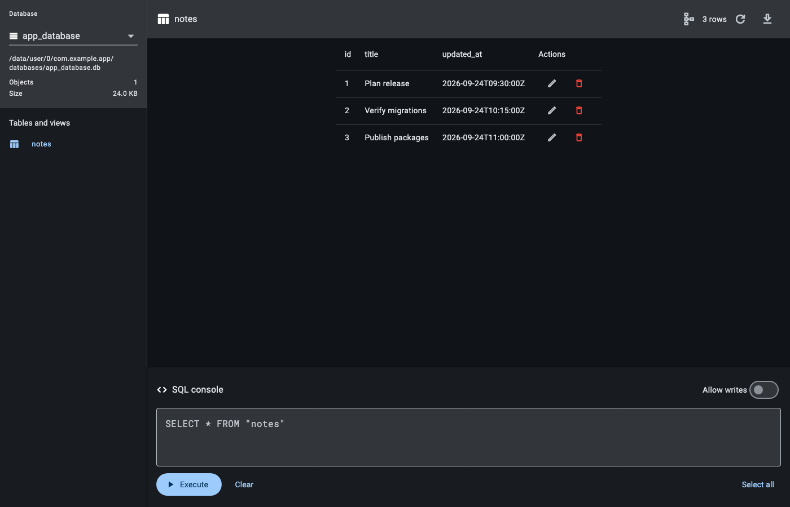

# native_sqlite DevTools extension

This private Flutter web package builds the database inspector shipped inside
`package:native_sqlite`. Users do not deploy or open this app directly: Flutter
DevTools discovers the compiled extension from
`native_sqlite/extension/devtools`.

## User workflow

1. Run an Android, iOS, or web app that depends on `native_sqlite` in debug
   mode and open at least one database.
2. Open Flutter DevTools from VS Code, Android Studio/IntelliJ, or a browser.
3. Enable `native_sqlite` in the DevTools **Extensions** menu, then select its
   tab.

To enable it for a project up front, add this at the project root:

```yaml
# devtools_options.yaml
extensions:
  - native_sqlite: true
```

The extension browses tables and views, shows column/index metadata, pages in
a stable order, exports a table as JSON, runs SQL, and edits or deletes one
identified row at a time. SQL writes require an explicit toggle; destructive
statements require an additional confirmation. SQL output keeps its own column
list, including duplicate names, and is capped at 1,000 rows.



## Security and privacy

The service extensions are registered only in debug builds and only on the
root isolate. DevTools communicates with the app through its existing DDS/VM
service connection; database rows are not sent to a hosted inspector or a
third-party service. Enabling any DevTools extension grants it the same
debug-session visibility as DevTools itself, so enable extensions only from
packages you trust.

Disable the inspector before the first database is opened:

```dart
InspectorConnect.enabled = false;
```

Or disable it for the whole build:

```console
flutter run --dart-define=NATIVE_SQLITE_INSPECTOR=false
```

## Troubleshooting

- **No tab:** confirm the app directly or transitively depends on
  `native_sqlite`, is a debug build, has opened a database, and is connected to
  DevTools. Check the DevTools **Extensions** menu for a disabled entry.
- **No databases:** keep the returned database handle open; closed/deleted
  databases are intentionally removed from discovery.
- **Protocol mismatch after an upgrade:** stop the app and DevTools, run
  `flutter pub get`, then start a fresh debug session.
- **Reconnect banner:** wait for hot restart to finish or press **Retry**.
- **Profile/release build:** the inspector is intentionally unavailable.

## Development

Run against a VM-service URI in the simulated DevTools environment:

```console
puro flutter run -d chrome \
  --dart-define=use_simulated_environment=true
```

Build, copy, validate, and run the tests from this directory:

```console
puro flutter pub run devtools_extensions build_and_copy \
  --source=. --dest=../native_sqlite/native_sqlite/extension/devtools
cd .. && puro dart tool/normalize_devtools_build.dart
cd native_sqlite_inspector
puro flutter pub run devtools_extensions validate \
  --package=../native_sqlite/native_sqlite
puro flutter test
```

Commit the generated extension build. CI rebuilds it and fails on any diff.

## Acknowledgements

Portions of the inspector are adapted from
[Isar Community Inspector](https://github.com/isar-community/isar-community/tree/v3/packages/isar_community_inspector)
and Isar Connect. They remain available under Apache-2.0; see
[NOTICE](NOTICE) and [LICENSES/Apache-2.0.txt](LICENSES/Apache-2.0.txt).
